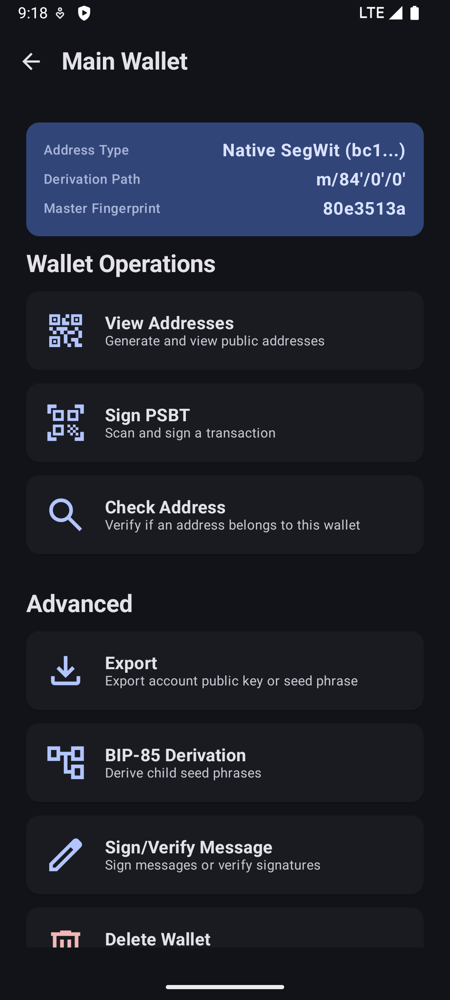
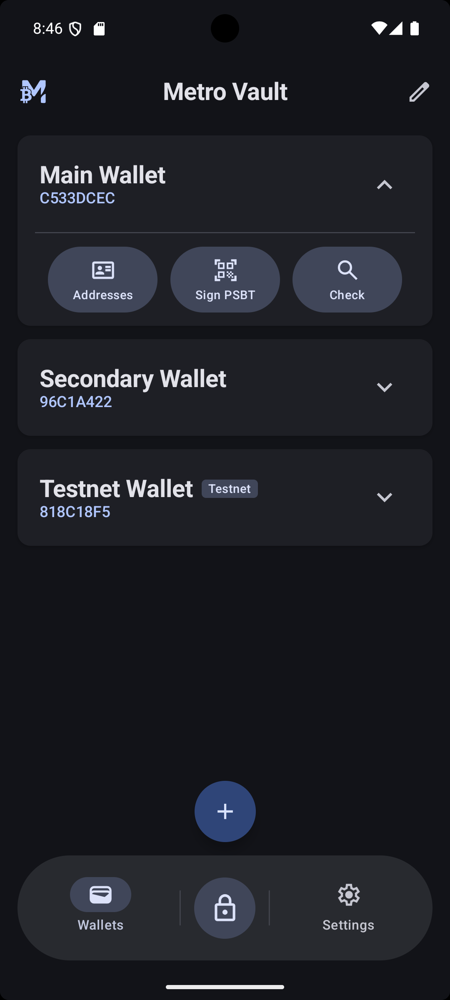
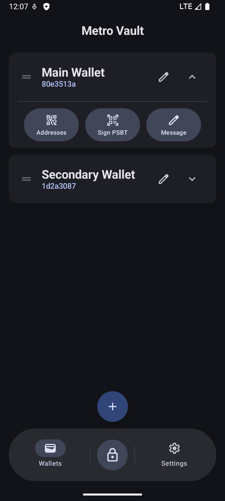
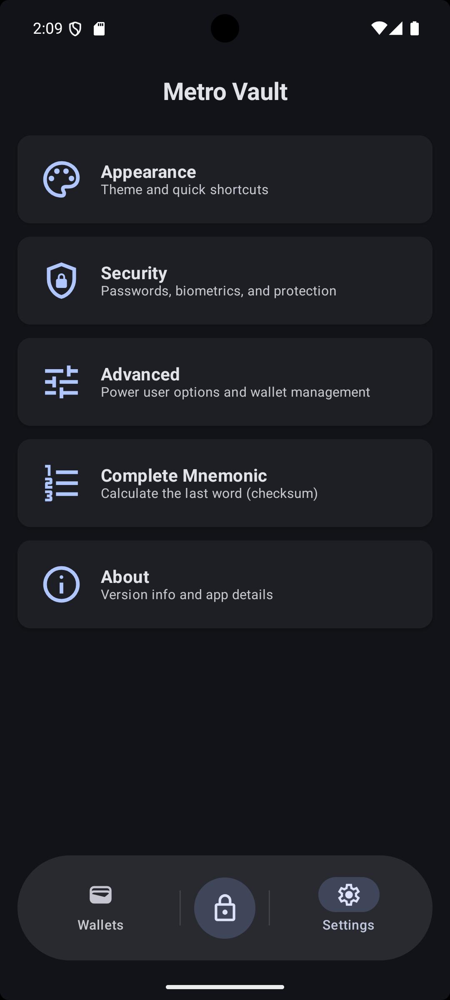

# MetroVault

<p align="center">
  
</p>

<p align="center">
  <strong>Turn your Android phone into a secure Bitcoin hardware wallet and signing device</strong>
</p>

<p align="center">
  
  
  
  
</p>

<p align="center">
  
  
  
  
</p>

---

**MetroVault** is a secure, offline Android signing device application designed to turn your Android phone into a cold storage hardware wallet. Built with modern Android technologies and a custom Kotlin Bitcoin library, it prioritizes security, simplicity, and user experience. Supports both single-sig and multi-sig (collaborative custody) wallets.

## Why MetroVault?

The primary goal of MetroVault is to provide a completely **offline** environment for managing Bitcoin private keys. It acts as a signer for your watch-only wallets (like BlueWallet, Sparrow, or Electrum) running on online devices. By keeping your keys on a device that never connects to the internet (air-gapped), you significantly reduce the attack surface for theft and malware.

**Key Benefits:**
- 💰 **Free** - Use any Android phone as a hardware wallet
- 🔒 **Secure** - Air-gapped operation with military-grade encryption
- 🔨 **Open Source** - Fully auditable code, no hidden backdoors
- 🎨 **Modern** - Beautiful Material 3 design with Jetpack Compose

## ✨ Features

### 🛡️ Security First
| Feature | Description |
|---------|-------------|
| **Air-Gapped Operation** | Designed for devices with no internet (Airplane mode, WiFi/Bluetooth disabled) |
| **Dual-Layer Encryption** | AES-256-GCM with PBKDF2 (210k iterations) + Android Keystore |
| **Biometric Authentication** | Hardware-backed fingerprint/face unlock with crypto binding |
| **Plausible Deniability** | Separate "Main" and "Decoy" wallets with different passwords |
| **Brute-Force Protection** | Exponential backoff rate limiting with 24-hour lockout |
| **Automatic Wipe** | Optional feature to completely wipe sensitive data after 3 unsuccessful login attempts |

### 💼 Wallet Management
- **Multi-Type Support**: Native SegWit (`bc1q...`), Taproot (`bc1p...`), Nested SegWit (`3...`), Legacy (`1...`)
- **Multi-Sig Support**: Import and sign for collaborative custody wallets (2-of-3, 3-of-5, etc.)
- **Passphrase Support**: Optional BIP-39 passphrase with choice to save locally or keep in session memory only
- **Testnet4 Support**: Import or create Testnet wallet for testing and development
- **Custom Entropy**: Add your own randomness via dice rolls or coin flips
- **Mnemonic Tools**: Built-in checksum calculator and validator
- **BIP-85 Derivation**: Generate child seeds (12/24 words) and secure passwords from your master seed
- **XPRIV Export**: Export wallet's extended private key (if needed)

### 📝 Transaction Signing
- **PSBT Workflow** (BIP-174): Partially Signed Bitcoin Transactions for single-sig and multi-sig
- **Multi-Sig Signing**: Sign your part of collaborative custody transactions (with locally saved keys)
- **Transaction Finalization**: Finalize fully-signed PSBTs into broadcastable transactions
- **QR Code Air-Gap**: Scan PSBT → Verify → Sign → Export via QR
- **Animated QR Support**: BC-UR (v1/v2) and BBQr formats for large transactions
- **Address Verification**: Confirm receive/change addresses on trusted screen
- **XPUB Export**: Generate watch-only wallets on your online device

### 🔗 Multi-Sig & Descriptors
- **Descriptor Import**: Import multi-sig wallets via QR (BC-UR v2, BBQr) or text
- **Descriptor Export**: Share your signer info for multi-sig setup (BIP-48 compatible)
- **Flexible Derivation**: Supports BIP-48 m/48'/0'/0'/2' and m/48'/0'/0'/1' paths

### 📖 Signing / Verifying Messages
- **Sign Messages**: Sign messages to prove ownership
- **Verify Signatures**: Verify signatures and messages
- **Qr Code Support**: Sign messages using QR codes, and display signature via QR codes.

## 🔄 How It Works

```
┌──────────────────┐          QR Code          ┌──────────────────┐
│   ONLINE DEVICE  │◄─────────────────────────►│  METROVAULT      │
│   (Watch-Only)   │                           │  (Air-Gapped)    │
├──────────────────┤                           ├──────────────────┤
│ • Create PSBT    │  ──── Unsigned PSBT ───►  │ • Verify details │
│ • Broadcast TX   │  ◄──── Signed PSBT ────   │ • Sign with key  │
│ • View balance   │                           │ • Never online   │
└──────────────────┘                           └──────────────────┘
```

1. **Setup**: Import your XPUB from MetroVault to create a watch-only wallet on your online device
2. **Receive**: Generate addresses on either device (they'll match!)
3. **Send**: Create unsigned transaction (PSBT) on online device → Display as QR
4. **Sign**: Scan QR on MetroVault → Verify → Sign → Display signed PSBT QR
5. **Broadcast**: Scan signed QR on online device → Broadcast to network

## 🛠️ Tech Stack

| Category | Technology |
|----------|------------|
| **UI Framework** | Jetpack Compose (Material 3) |
| **Architecture** | MVVM with Clean Architecture |
| **Cryptography** | Custom Kotlin Bitcoin Library (Secp256k1, BIP-32, BIP-39, BIP-48, BIP-174) |
| **Storage** | EncryptedSharedPreferences (Android Keystore) |
| **QR Codes** | ZXing + URKit (BC-UR v1/v2, BBQr for animated multi-frame QR) |
| **Biometrics** | AndroidX Biometric Library (BIOMETRIC_STRONG) |
| **Min SDK** | Android 8.0 (API 26) |

## 🚀 Installation

### Option 1: Build from Source (Recommended)

**Prerequisites:**
- Android Studio Ladybug or newer
- JDK 17
- Android device (API 26+)

**Steps:**
```bash
# Clone the repository
git clone https://github.com/gorunjinian/MetroVault.git

# Open in Android Studio
# Sync Gradle project
# Build
# Install on your air-gapped device
```

### Option 2: Download APK

Check the [Releases](https://github.com/gorunjinian/MetroVault/releases) page for pre-built APKs.

> ⚠️ **Security Note:** For production use, always build from source and install on a factory-reset device that remains permanently offline.

### Recommended Device Setup

For maximum security, use a dedicated device:

```
1. Factory reset before installation
2. Skip Google account setup (offline only)
3. Enable Airplane mode permanently  
4. Disable WiFi, Bluetooth, NFC, Mobile data
5. Remove SIM card
6. Disable USB debugging
```

## 📖 Documentation

Detailed documentation is available in the repository:

| Document | Description |
|----------|-------------|
| [SECURITY.md](./SECURITY.md) | Complete security architecture and encryption model |
| [SEED_GENERATION.md](./SEED_GENERATION.md) | How wallets are generated, stored, and used |

## 🤝 Contributing

Contributions are welcome! Please feel free to submit issues and pull requests.

### Reporting Issues

- **Bugs**: Open a GitHub issue with reproduction steps
- **Features**: Open a discussion or issue with your proposal
- **Security**: See [SECURITY.md](./SECURITY.md) for responsible disclosure

## 🙏 Acknowledgments

- [Bitcoin](https://bitcoin.org) - The protocol that makes this all possible
- [ACINQ](https://github.com/ACINQ/bitcoin-kmp) - Custom Bitcoin library from ACINQ's implementation
- [Jetpack Compose](https://developer.android.com/jetpack/compose) - Modern Android UI toolkit
- [ZXing](https://github.com/zxing/zxing) - QR code generation and scanning
- The open-source Bitcoin community for BIP standards

---

## ⚠️ Disclaimer

**MetroVault is currently in active development.**

While every effort is made to ensure security and correctness, using early-development software for managing real funds carries risks:

- Always verify addresses on the device screen
- Test with small amounts first
- **You are responsible for your own keys** - ensure proper mnemonic backups
- Review the code yourself or have it audited before trusting with significant funds

---

<p align="center">
  Made with ❤️ for Bitcoin by Gorun Jinian
</p>
