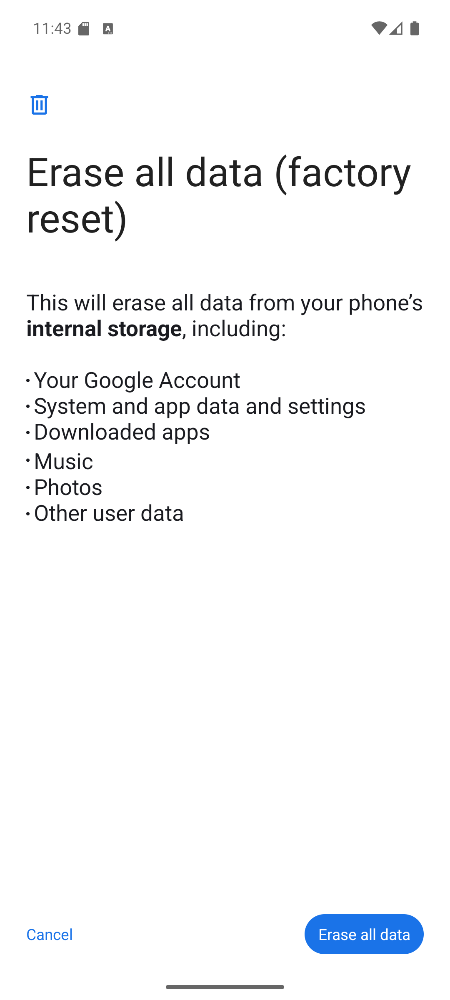
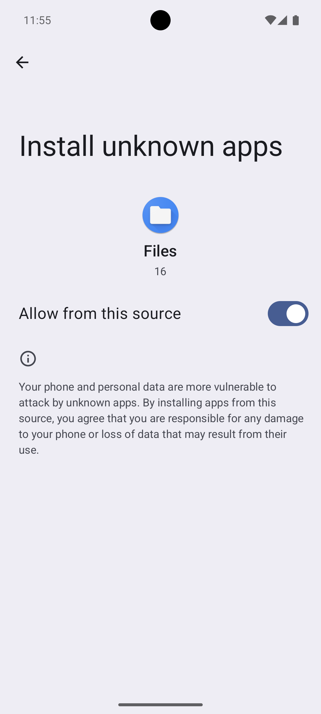
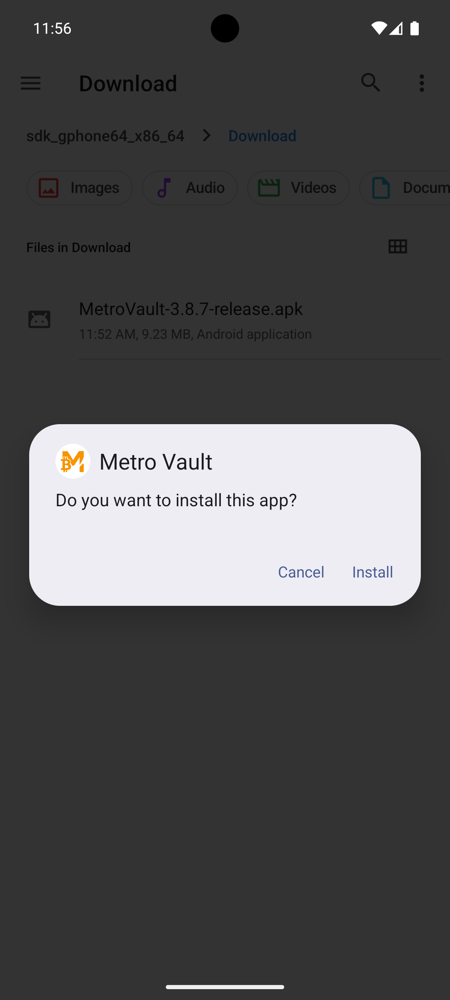
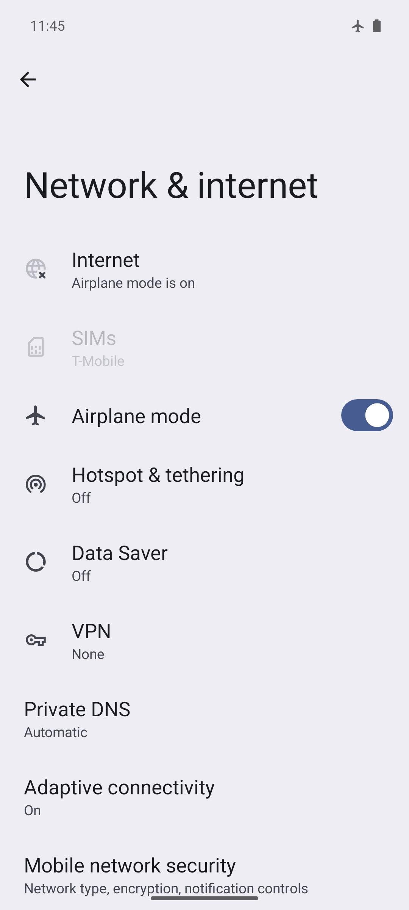
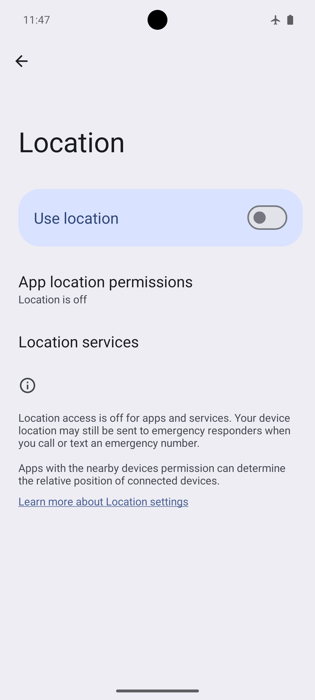
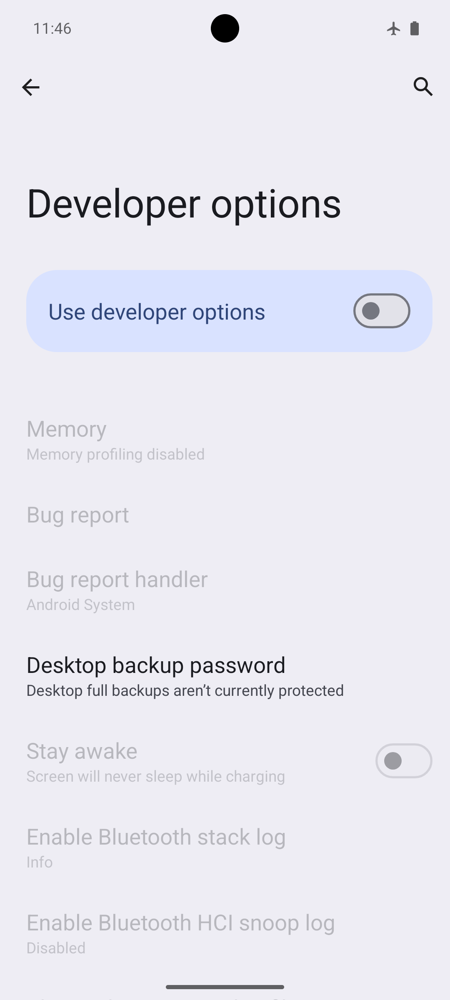
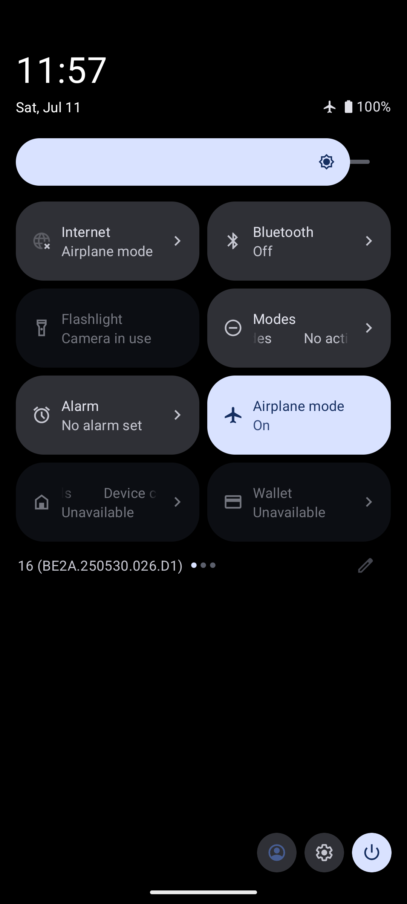
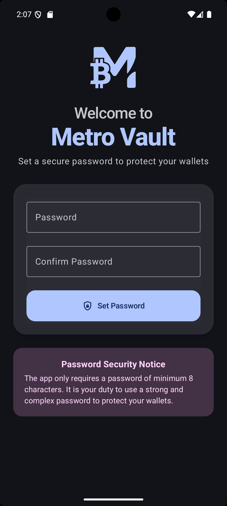
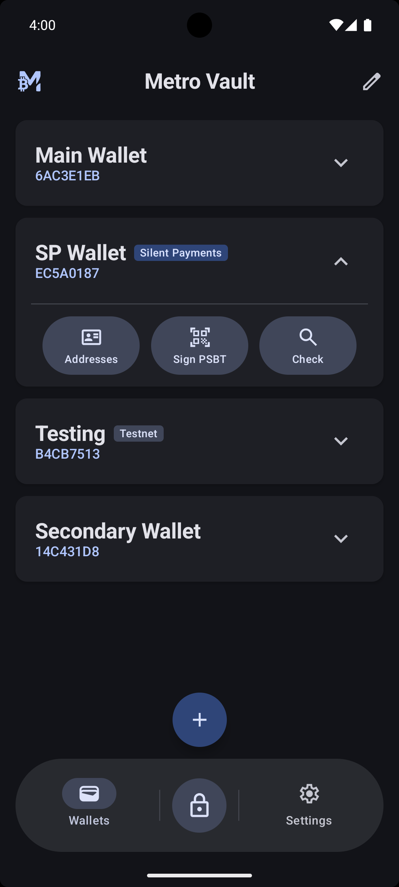

# Device Setup Guide

This is a step-by-step tutorial for turning a spare Android phone into a dedicated, air-gapped MetroVault signing device. It expands the [Recommended Device Setup](../README.md#recommended-device-setup) checklist in the README into a full walkthrough: what to do, **why** each step matters, and how to **verify** it worked.

When you finish, you will have a phone that:

- has been wiped to a clean, known state,
- has never touched the internet since that wipe,
- has every radio disabled (cellular, Wi-Fi, Bluetooth, NFC),
- cannot be read or controlled over USB,
- and runs MetroVault as the only sideloaded app.

> **Menus vary by device.** The instructions and screenshots below follow stock Android (Pixel). Samsung / One UI differences are noted inline. On any other device, use the search bar at the top of the Settings app to find the equivalent option.

<!--
  Screenshot convention: image tags below are commented out until the
  screenshots are captured. Uncomment each tag once the file exists in
  images/device-setup/. See images/device-setup/README.md for the full
  capture checklist.
-->

## What You'll Need

| Item | Purpose |
|------|---------|
| A spare Android phone (Android 8.0 / API 26 or newer) | The dedicated signing device. It will never go online again. |
| A computer or online phone | To download and verify the MetroVault APK. |
| A way to transfer the APK offline | USB cable (adb), SD card, or USB-OTG flash drive. |
| A SIM-eject tool or paperclip | To remove the SIM card. |
| 20–30 minutes | Most of it is the factory reset. |

**A note on the order of steps.** The SIM comes out *first*, so the device never attaches to a cellular network after the wipe. And because an air-gapped phone cannot download anything, the MetroVault APK has to get onto the device *before* it goes permanently offline — but *without* the device itself ever connecting to the internet. That is why this guide transfers the APK from another machine instead of installing from F-Droid on the device. The steps below are in the correct order; don't rearrange them.

---

## Step 1 — Remove the SIM Card

**Why:** The cellular baseband is a separate processor with its own firmware that the Android OS doesn't fully control. Even with no data used, a phone with a SIM registers with nearby cell towers the moment it boots — identifying itself and its location. Removing the SIM before the wipe means the device never attaches to a cellular network again in its new life. (Airplane mode, later, disables the radio in software as well — defense in depth.)

**How:**

1. Power the phone off.
2. Eject the SIM tray with a SIM-eject tool or paperclip and remove the card.
3. If the phone has an **eSIM** you still need, transfer it to another device now — it gets erased in the next step.

<!--  -->

**Verify:** After the phone boots again in Step 2, the status bar shows no signal bars and no SIM icon, and **Settings → Network & internet → SIMs** lists no SIM.

---

## Step 2 — Factory Reset

**Why:** A factory reset removes every app, account, and setting from the phone's previous life — including any malware, stale login sessions, or apps with network access. It gives you a clean, known starting state, and re-encrypts user data with fresh keys.

**How:**

1. Back up anything you still want from the phone — everything will be erased.
2. Power the phone on and open **Settings → System → Reset options → Erase all data (factory reset)**.
   - *Samsung:* **Settings → General management → Reset → Factory data reset**.
3. If the reset screen offers **Erase downloaded eSIMs**, tick it so no eSIM profile survives the wipe.
4. Confirm and wait for the device to reboot into the setup wizard.



**Verify:** The phone boots into the "Hi there" / language-selection setup wizard, as if new out of the box — with no signal bars in the status bar.

---

## Step 3 — Set Up Android Offline (Skip Google Account)

**Why:** Signing in to a Google account links the device to your identity, enables cloud sync and backups, and allows remote actions like Find My Device and remote app installs. A signing device should have no accounts, no backups, and no remote management. Skipping Wi-Fi during setup means the device never touches a network at all in its new life.

**How:**

1. In the setup wizard, choose your language and continue.
2. On the Wi-Fi screen, **do not connect**. Tap **Set up offline** (sometimes shown as "Skip" or hidden behind "See all Wi-Fi networks → Skip").
3. Accept the warning that some features won't be available — that is exactly what we want.
4. **Skip** the Google account sign-in, and skip any offers to restore apps or data.
5. Set a **strong device PIN or password** when prompted (you can also do this later — see Step 8). This is the device's screen lock, separate from MetroVault's master password.
6. Skip everything else (Google services, assistant, etc.) until you reach the home screen.

<!--  -->

**Verify:** **Settings → Passwords & accounts** (*Samsung:* **Settings → Accounts and backup → Manage accounts**) lists **no accounts**.

---

## Step 4 — Download and Verify the MetroVault APK (on your computer)

**Why:** The signing device can't (and shouldn't) download anything, so you fetch the APK on another machine. Verifying the APK's signing certificate before transferring it proves the file is the genuine release and wasn't tampered with in transit.

**How:**

1. On your computer, download the latest APK from [GitHub Releases](https://github.com/gorunjinian/MetroVault/releases) or mirror it from [F-Droid](https://f-droid.org/packages/com.gorunjinian.metrovault/). Both are signed with the same developer key (F-Droid builds are [reproducible](https://f-droid.org/docs/Reproducible_Builds/)).
2. Verify the signing certificate with `apksigner` (ships with the Android SDK build-tools):

   ```bash
   apksigner verify --print-certs MetroVault-X.Y.Z-release.apk
   ```

   Or, if you have a JDK but not the Android SDK:

   ```bash
   keytool -printcert -jarfile MetroVault-X.Y.Z-release.apk
   ```

3. Confirm the certificate SHA-256 digest matches exactly:

   ```
   1245554ceb17cea21e9912af7bf60d38d716f5884d4b3664e5338462cc76fd03
   ```

   If it does not match, **stop** — do not install the APK.

> **Building from source instead?** If you build your own APK (the most trustless option — see [Installation](../README.md#-installation)), it will be signed with *your* key and the fingerprint above won't apply. Everything else in this guide is the same.

---

## Step 5 — (Optional, but Recommended) Debloat the Device

**Why:** A factory-fresh phone still ships with dozens of pre-installed apps, many of which try to reach the network. None of them can succeed once the radios are off, but removing them shrinks the attack surface and removes background noise.

**How:**

1. On the phone, enable Developer options: **Settings → About phone → tap "Build number" seven times**.
   - *Samsung:* **Settings → About phone → Software information → tap "Build number" seven times**.
2. Enable **Settings → System → Developer options → USB debugging**.
3. Connect the phone to your computer via USB and accept the "Allow USB debugging?" fingerprint prompt on the phone.
4. Run [android-debloater](https://github.com/gorunjinian/android-debloater), a companion script that uses `adb` to uninstall bloatware and pre-installed network-reaching apps. Review what it proposes before confirming.

Leave USB debugging on for now if you plan to install the APK over `adb` in the next step — it gets disabled for good in Step 8.

---

## Step 6 — Install MetroVault

**Why:** This is the last thing that needs to reach the device from the outside world. After this step, the phone goes offline permanently.

**How — Option A: SD card or USB-OTG drive** (no USB debugging needed):

1. Copy the verified APK onto an SD card or USB-OTG flash drive.
2. Insert it into the phone and open the APK with the built-in **Files** app.
3. When prompted, allow the Files app to **install unknown apps** (this permission prompt appears once, in-line).
4. Confirm the install.



**How — Option B: adb** (if you already enabled USB debugging in Step 5):

```bash
adb install MetroVault-X.Y.Z-release.apk
```



**Verify:** MetroVault appears in the app drawer. Don't set it up yet — finish locking the device down first.

---

## Step 7 — Go Permanently Offline

**Why:** Airplane mode disables the cellular, Wi-Fi, and Bluetooth radios in one switch and persists across reboots. But modern Android lets individual radios be re-enabled *inside* airplane mode (and remembers that choice), and it keeps scanning for Wi-Fi/Bluetooth networks for location purposes even when the radios are "off." So: airplane mode first, then explicitly disable everything underneath it.

**How:**

1. Swipe down and enable **Airplane mode** from Quick Settings.
2. Confirm **Wi-Fi** is off — and stays off. Don't re-enable it inside airplane mode, or Android will remember that.
3. Confirm **Bluetooth** is off.
4. Turn off **NFC**: **Settings → Connected devices → Connection preferences → NFC**.
   - *Samsung:* **Settings → Connections → NFC and contactless payments**.
   - Not all devices have NFC; if you can't find the setting, your device likely doesn't have it.
5. Turn off background scanning: **Settings → Location → Location services → Wi-Fi scanning** and **Bluetooth scanning** — both off.
   - *Samsung:* **Settings → Connections → More connection settings → Nearby device scanning**, plus the same Location services toggles.
6. Turn off **Location** entirely: **Settings → Location**.
7. Turn off **Quick Share / Nearby Share** if present: **Settings → Connected devices → Connection preferences → Quick Share**.




**Verify:** The airplane-mode icon shows in the status bar, and **Settings → Network & internet** (*Samsung:* **Connections**) shows Wi-Fi, Bluetooth, and mobile data all off. If the phone had an eSIM that somehow survived Step 2, erase it now: **Settings → Network & internet → SIMs → (select the eSIM) → Erase eSIM** (*Samsung:* **Settings → Connections → SIM manager**).

---

## Step 8 — Disable USB Debugging and Lock the Device Down

**Why:** With USB debugging enabled, anyone with physical access and a computer can pull data off the device, install apps, and capture the screen over `adb`. This must be off on a signing device. This step also covers the device-level screen lock, which protects the phone itself (MetroVault's master password protects the wallets on top of that).

**How:**

1. Open **Settings → System → Developer options**.
2. Tap **Revoke USB debugging authorizations** (removes your computer's stored key).
3. Turn **USB debugging** off.
4. Turn the whole **Developer options** switch off at the top of the screen.
5. If you didn't set a screen lock in Step 3, set a strong PIN or password now: **Settings → Security & privacy → Device unlock**.
6. If you want to use fingerprint unlock inside MetroVault (it uses hardware-backed `BIOMETRIC_STRONG`), enroll a fingerprint: **Settings → Security & privacy → Device unlock → Fingerprint**.



**Verify:** **Developer options** no longer appears under **Settings → System**. Plugging the phone into a computer charges it but `adb devices` lists nothing.

---

## Final Verification Checklist

Run through this before creating your first wallet:

- [ ] Airplane-mode icon is visible in the status bar
- [ ] No signal bars / no SIM icon
- [ ] Wi-Fi, Bluetooth, and NFC are all off in Settings
- [ ] Wi-Fi scanning and Bluetooth scanning are off (Location services)
- [ ] Location is off
- [ ] No accounts under Settings → Passwords & accounts
- [ ] Developer options is hidden again; `adb devices` on a connected computer shows nothing
- [ ] Opening any built-in browser or app that needs the network fails
- [ ] Device screen lock (PIN/password) is set



---

## First Launch

The device is ready. Open MetroVault:

<p align="center">
  
  
</p>

1. **Set your master password.** Minimum 8 characters, but use a long, strong one — it derives the key that encrypts everything (PBKDF2, 600,000 iterations). There is **no password recovery** by design; if you forget it, only your mnemonic backups can restore your wallets.
2. **Create or import a wallet.** See [SEED_GENERATION.md](./SEED_GENERATION.md) for exactly how seeds are generated and stored. Write the mnemonic down on paper (never digitally) and verify your backup.
3. **Export the XPUB** to your online watch-only wallet (Sparrow, BlueWallet, Electrum) via QR code, and you're ready for the signing workflow described in [How It Works](../README.md#-how-it-works).

For the full security architecture — encryption layers, decoy wallets, brute-force protection — see [SECURITY.md](./SECURITY.md).

---

## Keeping It Air-Gapped

**Do:**

- Keep the device in airplane mode forever. There is no situation where a signing device needs to go online.
- Charge it with a wall charger, or a computer is fine too — with USB debugging off, the USB connection is charge/file-transfer only and `adb` cannot attach.
- Test the full sign-and-broadcast loop with a small amount first.

**Don't:**

- Don't re-insert a SIM or connect to Wi-Fi "just once" (for updates, see below).
- Don't install other apps on the device. MetroVault should be its only job.
- Don't type your mnemonic into anything other than MetroVault on this device.

### Updating MetroVault

Updates follow the same offline path as the original install:

1. Download the new APK **on your computer** and verify the certificate fingerprint exactly as in Step 4.
2. Transfer it via SD card / USB-OTG and install it over the existing app (Option A of Step 6). Android will only accept the update if it's signed by the same key as the installed version — a tampered APK is rejected automatically.
3. If you prefer `adb install -r`: temporarily re-enable Developer options and USB debugging, install, then **revoke authorizations and disable both again** (Step 8).

Your wallets, keys, and settings survive updates — but never rely on that as a backup. Your paper mnemonic backup is the only backup that counts.
